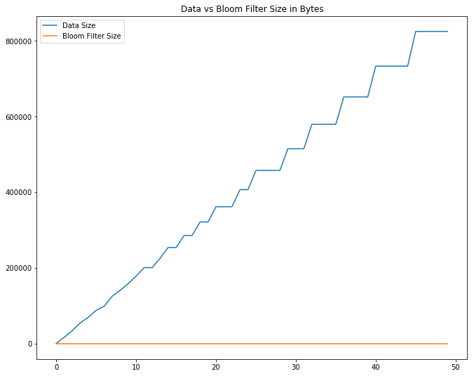

# [Draft] Data Structure Series - Bloom Filter

## What is it?
It is a probabilistic data structure, that is commonly used to ask question "whether an element is in it or not?". From my description, it does seems like a job that [Set](https://brilliant.org/wiki/sets-adt/) can do, sooo...

## Why Should We Use It?
The major advantage of Bloom Filter is [space complexity](https://www.cs.northwestern.edu/academics/courses/311/html/space-complexity.html), while other data structures, such as Set and HashTable requires to store the data itself, Bloom Filter does not requires data storing. 

## When Should We Use It?
Although Bloom filter has major space complexity advantage, yet it can only answer in probabilistic term: whether an item is "possibly in the filter" or "not a chance in the filter". Because of this characteristic of Bloom filter, you will only want to use it if :
1. You need better space complexity.
2. You can tolerate false positives.
3. You would not need to delete items from the filter. Simple bloom filter cannot support removal operation.

## How Should We Implement It?
There are a couple of components to implement the bloom filter.

### A Simple Bloom Filter


```python
import sys
import math
# using murmur hashing function because it returns integer
import mmh3
```


```python
# use bitarray to manage our main data structure
from bitarray import bitarray
```


```python
class SimpleBloomFilter(object):
    def __init__(self, hash_fn, m, fpr):
        self._fpr = fpr
        self._hash_fn = hash_fn
        
        # size of bitarray that we should construct
        self.size = int(-(m * math.log(fpr)) / (math.log(2) ** 2))
        
        # k = how many time should we do the hash
        self._k = math.ceil((m/self.size) * math.log(2))
        
        # construct and initialize the bit array
        self._bit_array = bitarray(self.size)
        self._bit_array.setall(0)
        
    def add(self, item):

        for i in range(self._k):
            digest = self._hash_fn.hash(item, i) % self.size
            # set the bit into 1
            self._bit_array[digest] = 1
    
    def is_possibly_exists(self, item):
        for i in range(self._k):
            digest = self._hash_fn.hash(item, i) % self.size
            # check if the digest is in bit array
            # if there is one 0 found in bit_array, then
            # the item does not exists at all
            if not self._bit_array[digest]:
                return False
            
        return True
    
```

After we have constructed the simple bloom filter class, we are now ready to test this out!


```python
test_elements = [
    'hello world',
    'hello 1',
    'hello3'
]
bf = SimpleBloomFilter(mmh3, len(test_elements), 0.01)
for el in test_elements:
    bf.add(el)
    
for el in test_elements:
    print('is `{}` exists in the filter? {}'.format(el, bf.is_possibly_exists(el)))

test1 = 'not exists'
print('is `{}` exists in the filter? {}'.format(test1, bf.is_possibly_exists(test1)))
```

    is `hello world` exists in the filter? True
    is `hello 1` exists in the filter? True
    is `hello3` exists in the filter? True
    is `not exists` exists in the filter? False


It turns out working like we are expecting! Hurray! Now we want to see how much space that we save for implementing the bloom filter


```python
print('size of test elements: {} bytes'.format(sys.getsizeof(test_elements)))
print('size of bloom filters: {} bytes'.format(sys.getsizeof(bf)))
```

    size of test elements: 88 bytes
    size of bloom filters: 56 bytes


It doesn't seems to be much of saving, eh? Let's simulate it with larger elements!


```python
import hashlib

def simulate_bloom_filter_size(element_size):
    # generate larger test elements
    test_elements = list()
    test_element_length = element_size
    bf = SimpleBloomFilter(mmh3, test_element_length, 0.01)

    for i in range(test_element_length):
        str_generator = hashlib.md5('{}'.format(i).encode())
        el = str_generator.hexdigest()
        test_elements.append(el)
    
    return (sys.getsizeof(test_elements), sys.getsizeof(bf._bit_array), bf)
```


```python
el_size = 10000
print('With {} Elements'.format(el_size))
print('------------------------------------------')
data_size, bf_size, _ = simulate_bloom_filter_size(el_size)
print('size of test elements: {:,} bytes'.format(data_size))
print('size of bloom filters: {:,} bytes'.format(bf_size))
```

    With 10000 Elements
    ------------------------------------------
    size of test elements: 87,624 bytes
    size of bloom filters: 96 bytes


Okay we got this, but we want to know more! what if we extends until 100000?


```python
import numpy as np
import matplotlib.pyplot as plt
```


```python
observation_len = 50
c = np.linspace(1, 100000, observation_len)
data_sizes = list()
bf_sizes = list()
for el_size in c:
    data_size, bf_size, bf = simulate_bloom_filter_size(int(el_size))
    data_sizes.append(data_size)
    bf_sizes.append(bf_size)

f, ax = plt.subplots(figsize=(11, 9))
plt.title('Data vs Bloom Filter Size in Bytes')
plt.plot(np.arange(observation_len), data_sizes, label='Data Size')
plt.plot(np.arange(observation_len), bf_sizes, label='Bloom Filter Size')
plt.legend()
plt.show()
```





```python
print('largest data size: {:,} bytes'.format(data_sizes[-1]))
print('largest bloom filter size: {:,} bytes'.format(bf_sizes[-1]))
```

    largest data size: 824,464 bytes
    largest bloom filter size: 96 bytes


# Conclusion
1. Bloom Filter is awsome! (if you have matched the condition to use it!)

<center>

</center>

# References
- https://en.wikipedia.org/wiki/Bloom_filter
- https://stackoverflow.com/questions/11669178/how-to-create-an-array-of-bits-in-python
- https://www.geeksforgeeks.org/bloom-filters-introduction-and-python-implementation/
- https://stackoverflow.com/questions/449560/how-do-i-determine-the-size-of-an-object-in-python
